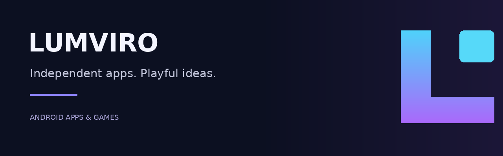

## Small apps. Bright ideas.

Lumviro is an independent developer brand creating mobile apps and planning future games. Development currently focuses on Android, with iOS planned for the future. The focus is on expressive visuals, useful everyday tools, and simple controls.

### Meet Bannerivo

**Your words. A brighter screen.**

Create colorful LED messages, choose fonts and motion, and display your banner in portrait or landscape.

- **Make it yours:** customize text, colors, backgrounds, and movement.
- **Keep and share:** save projects and export banner visuals as videos or GIFs.
- **Add your voice:** record clips and explore playback effects. Visual exports do not include recorded audio.

**Status:** preparing for release on Google Play.

[Explore Bannerivo →](https://lumviro.github.io/lumviro-site/)

### Get in touch

Questions about Bannerivo, support, or privacy: **[lumviro@gmail.com](mailto:lumviro@gmail.com)**.

[Website](https://lumviro.github.io/lumviro-site/) · [Website repository](https://github.com/LUMVIRO/lumviro-site)
